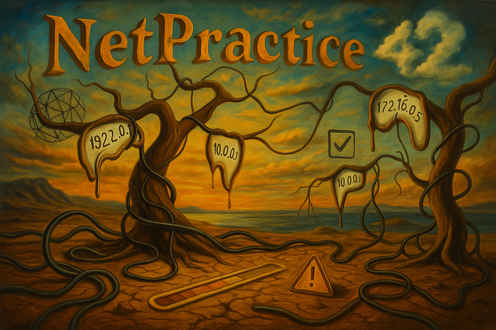

|           Grade          |                           |
|:------------------------:|:-------------------------:|
| 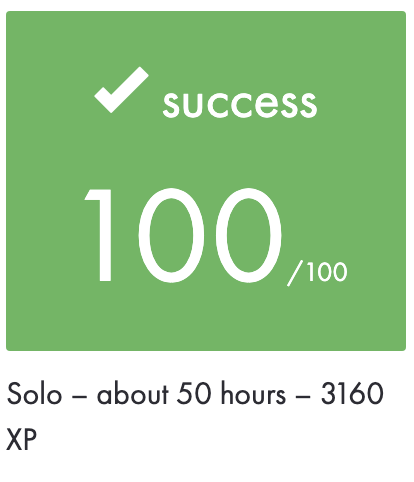 | 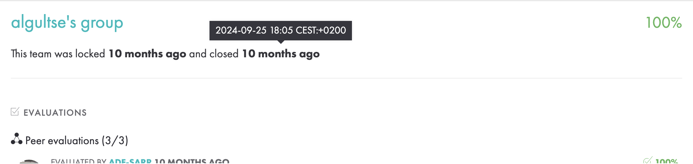 |

 

---

🇫🇷 FRENCH VERSION

	Ceci est un <a href="./subject/Net_Practice.fr.subject.pdf">projet</a>, réalisé à l'école 42 en septembre 2024.

## Préambule
Le but est de familiariser avec les bases du réseau informatique, à travers des exercices interactifs de `diagnostic`, d’`adressage IP` et de configuration de réseaux.

## Contenu
- `10 niveaux` de mise en situation avec des `réseaux` défaillants à corriger.
- Chaque niveau présente un schéma de réseau incomplet ou erroné qu’il faut corriger.
- Utilisation de l’interface web fournie (fichier `index.html`) pour simuler et tester les solutions.
- Exportation de chaque configuration validée.

## Compétences:
- Compréhension du modèle `TCP/IP` et du fonctionnement des `routeurs`.
- Maîtrise des bases de l’`adressage IPv4`.
- Résolution de problèmes liés à la `connectivité réseau`.
- Utilisation de la calculatrice `bc` pour les conversions binaires/décimales.

---

🇬🇧 ENGLISH VERSION

	This is a <a href="./subject/Net_Practice.en.subject.pdf">project</a>, completed at 42 school in September 2024.

## Preamble
The goal is designed to networking through hands-on problem-solving exercises focused on `IP addressing`, `routing`, and `debugging` misconfigured networks.

## Content
- `10` interactive `levels` with broken network setups to fix.
- Each level provides a faulty or incomplete network diagram.
- Use of the provided web interface (`index.html`) to configure and test networks.
- Export each correct configuration.

## Skills:
- Understanding the `TCP/IP` model and `routing` principles.
- Mastery of `IPv4 addressing` basics.
- Diagnosing and fixing connectivity issues in a `simulated environment`.
- Using the `bc` calculator for binary/decimal conversions.

---

🇷🇺 RUSSIAN VERSION

	Это <a href="./subject/Net_Practice.en.subject.pdf">проект</a>, выполненный в школе 42 в сентябре 2024 года.

## Преамбула
Цель — познакомиться с базами сетевых технологий, научиться `диагностировать` и `настраивать IP-сети` через серию интерактивных заданий.

## Содержание
- `10 уровней` с неработающими сетями, которые нужно исправить.
- Каждый уровень содержит схему сети с ошибками, которые нужно устранить.
- Использование встроенного интерфейса (`index.html`) для настройки и проверки конфигурации.
- Экспорт рабочей конфигурации.

## Навыки:
- Понимание модели `TCP/IP` и `маршрутизации`.
- Основы `адресации в IPv4`.
- `Диагностика` проблем с сетью.
- Конвертация чисел с помощью `bc` (двоичная/десятичная системы).

---

 

## My implementation

> ⚠️ Attention : spoiler ⚠️

Level 01

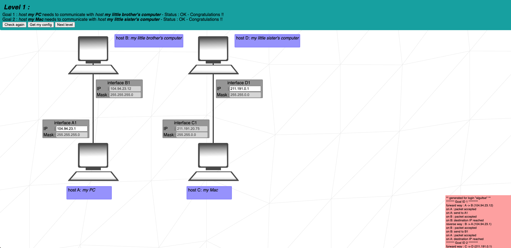

Level 02

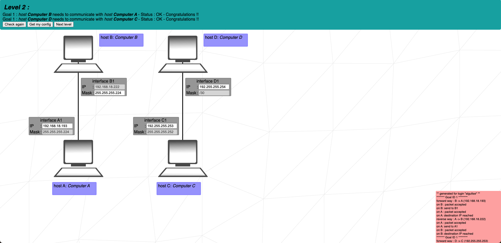

Level 03

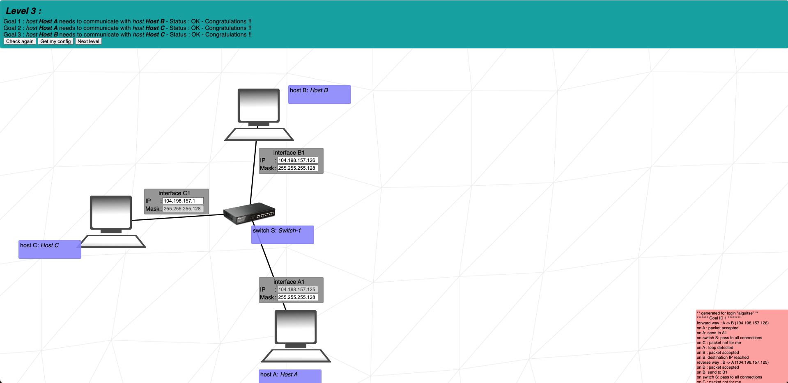

Level 04

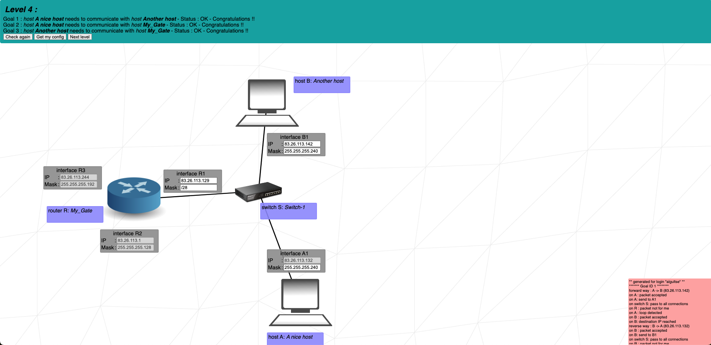

Level 05

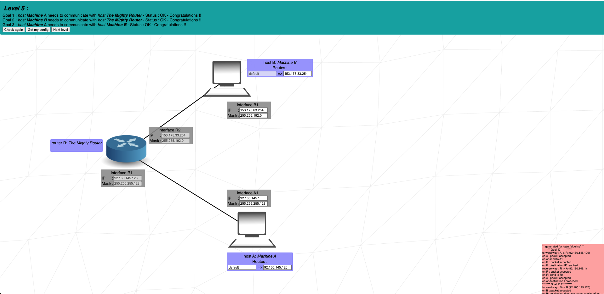

Level 06

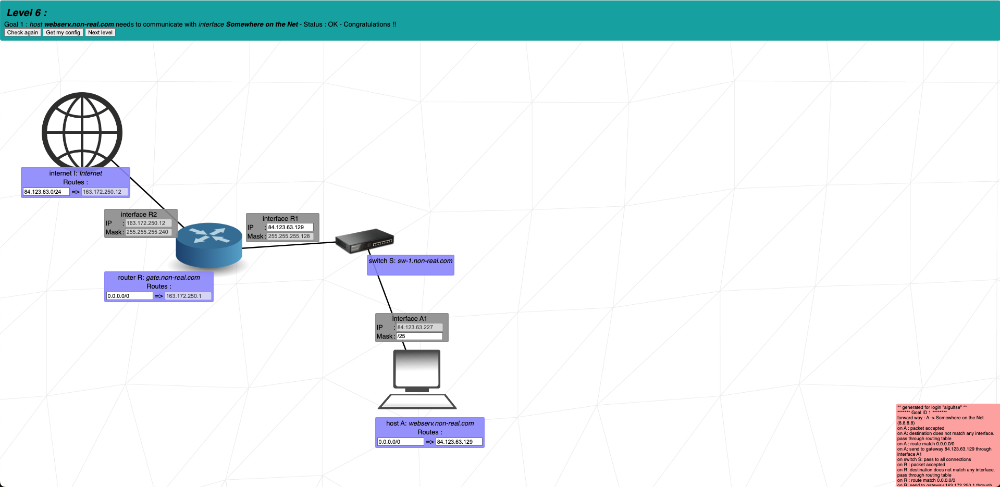

Level 07

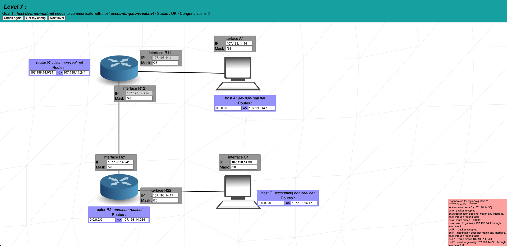

Level 08

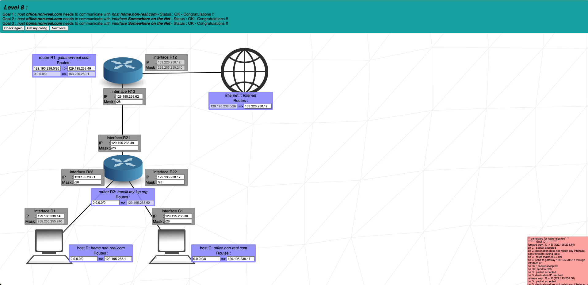

Level 09

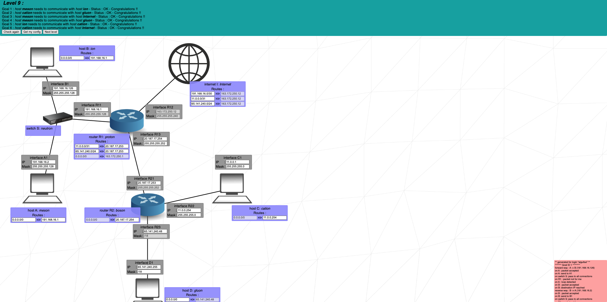

Level 10

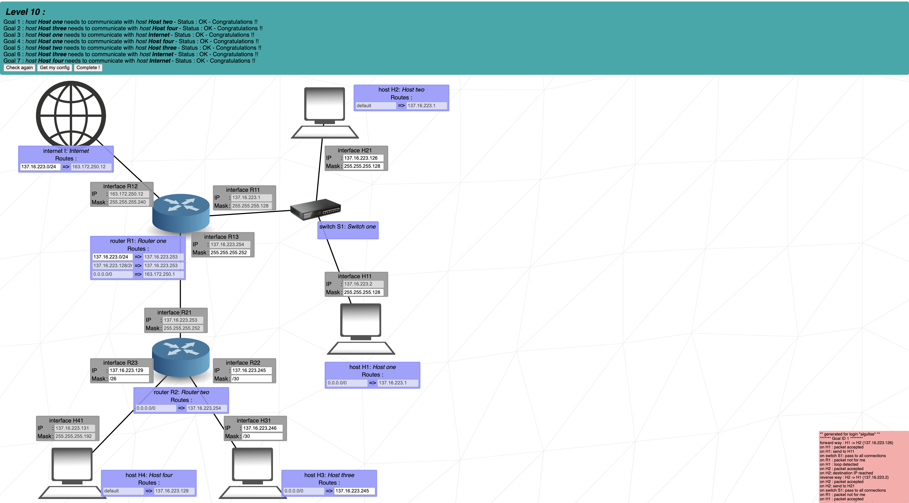

 
